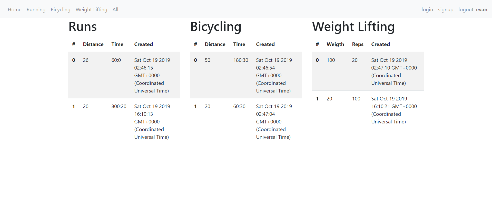

# Workout Tracker

## Purpose

This is a simple site to keep track of runs, weightlifting and bicycling workouts.

## Instructions

You will need to make an account first. After that you can click to the different types of workouts, enter the information to have it recorded to your account.

## Link to Deployed Version
https://workout-tracker-evan.herokuapp.com/signup

## Images

## Author

Evan Jones: https://github.com/EvanJJones

## Technologies Used

Node.js, Express, Bootstrap, MongoDB, HTML, CSS, Javascript

## Contact

evan@evanjjones.com
